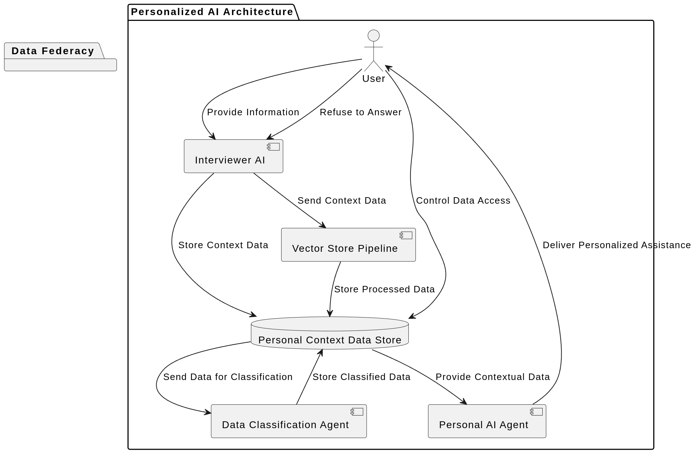
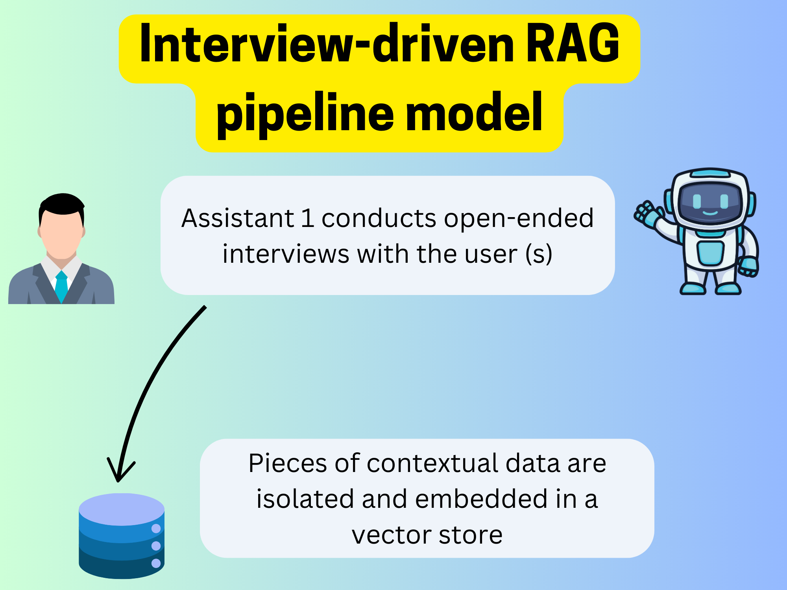
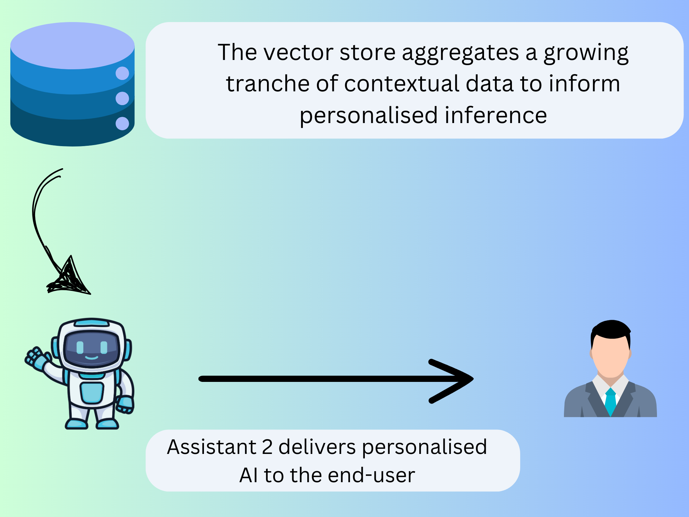
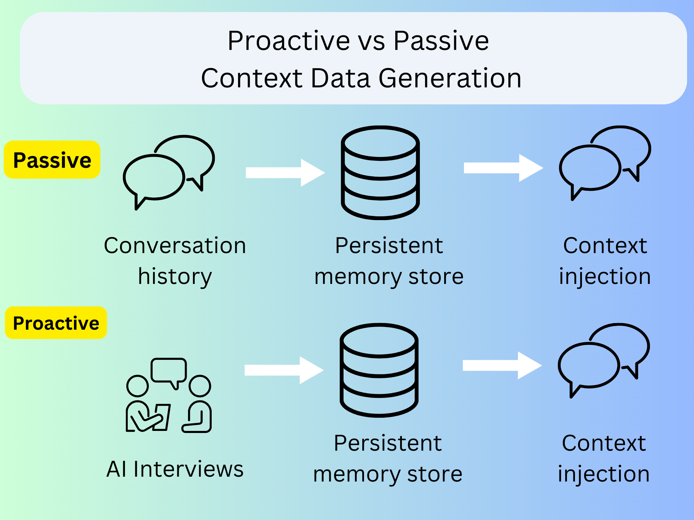
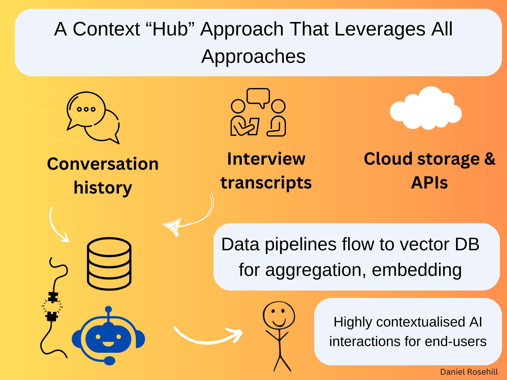

# Personalized AI: A Model for a Proactive, Interview-Based Context Generation Architecture

*By: Daniel Rosehill*

*Date: 2025-01-28*

## Summary

This repository proposes an architecture for generating personalized context data for AI systems.  Instead of relying on passive data collection, this system advocates for a proactive, interview-driven approach.  An "Interviewer" AI agent gathers detailed information from the user, which is then stored in a personal context data store.  This data fuels a personalized AI agent, providing increasingly accurate and relevant assistance. This user-centric approach prioritizes data privacy and empowers individuals to shape their AI experience.

## Diagram

## Details

This GitHub repository documents an idea I've been developing regarding context storage and the rapid advancements in AI assistants and agents.  It combines several system components I've been working on to outline a unified system for achieving personalized AI interactions.

Large language models (LLMs) learn from training data, and the selection of this data heavily influences the model's capabilities. Therefore, careful consideration is required when choosing training data.

Even domain-specific training data lacks personalization.  While no one wants sensitive information like their bank balance publicly available, introducing even small amounts of personalized contextual data to LLMs can dramatically improve the relevance of their inferences.

Retrieval Augmented Generation (RAG) has emerged as the standard method for injecting contextual data.  Using embedding models, files are converted into numerical representations and stored in specialized vector databases optimized for LLM access.

A simple implementation involves a user uploading a file (e.g., a resume) to a vector database. This database is then connected to an agent providing personalized career advice.

At scale, this process can be dynamic.  Instead of manual uploads, a continuously populated data store (e.g., an S3 bucket or Google Drive) is connected to the vector database through a RAG pipeline.

This has generated excitement for RAG in business workflows, such as internal tool development.  A support team could access a model connected to the company's JIRA or Confluence, ensuring the agent and users always have the latest internal information.  Another approach uses a user's conversation history with a model to distill contextual data, essentially a conversation-to-memory pipeline.

## Deliberate Contextual Data Generation

Both RAG pipelines and memory stores passively create and aggregate context data. The context data used to enhance LLM interaction isn't generated deliberately but extracted from existing knowledge and converted into a usable format for AI workloads.

One drawback is that while effective, these systems are long-term gambits.  A model gradually learns more about the user, and this data footprint can be self-correcting. However, it requires a slow approach, and the utility of the contextual data might not be immediately apparent to end-users.

The system I propose takes an active approach to context data creation.  Instead of grafting existing data stores onto AI tools, we should deliberately invest in generating context data.  This involves a specific workflow combining existing tools:

## 1: The "Interviewer"

The first component is an AI assistant acting as an inquisitive interviewer.  This assistant can be created using existing APIs or as a system prompt on any LLM.  Users can create a single interviewer bot or a network of bots, each specializing in a specific knowledge domain.

The system prompt should configure the assistant to act as an interviewer and explain the purpose of this interaction.  A sample system prompt (remember, prompt engineering is an evolving art):

## Example System Prompt For Interviewing Assistant

Your purpose is to interview the user, asking a wide range of questions to gather substantial data about their life. This data will be used to create a personalized context store for improving LLM-based assistants.

Begin by asking if the user wants to focus on a specific domain (e.g., professional life, health). Tailor your questions accordingly (e.g., career objectives, medical history).

Once you have clarified the scope, ask questions randomly within that topic. When you have enough information for a contextual data file within your context window, present it to the user.

If the context window is nearing its limit, inform the user and output the gathered context data. You can continue the conversation afterward. "Context window closing" means you anticipate not being able to aggregate all gathered information within your output limit.

Summarize the context data in the third person, referring to the user as "the user." Isolate contextual data relevant to grounding assistant performance. For example:

User input: "I live in Jerusalem. Today I woke up with a small headache, but after drinking a few glasses of water I felt a lot better. Have a meeting tomorrow with my boss. I work in sustainable finance."

Contextual summary: "User lives in Jerusalem. User works in sustainable finance."

If the user requests a more liberal approach, include more details. For example: "User lives in Jerusalem. User occasionally suffers from headaches. User works in sustainable finance."

Output the contextual data snippets as a continuous markdown block within a code fence.

## 2: The Vector Store Pipeline (or Manual Approach)

This stage involves either an agentic process (the interviewer writes data directly into the context pipeline) or a manual process (the user copies and uploads the data).

## 3: The Personal Agent

The collected context snippets are aggregated into a personal context data store (e.g., a namespace within a vector database). This data store is connected to a personal assistant agent configured to provide general guidance within the context of the personal data. The more information gathered, the more accurate the personal agent's output.

## 4: The Data Classification Agent (Optional)

In multi-agent frameworks, the initial context data can be considered a "slush pile." A data classification agent could segment this data, separating personally identifiable information from less sensitive context data that could be shared with more services.  This could even enable the context data store to function as a personal data footprint, replacing manual data entry for forms.

## Data Federacy

This architecture prioritizes personal data sovereignty.  Users proactively generate and control their contextual data, decoupling it from any single AI company. The user can refuse to answer questions, preventing the capture of specific data.

## "Passive" Vs. "Proactive" Context Data Generation

## How Multiple Contextual Data Sources Could Coexist In Integrated RAG Pipelines

## Potential Use Cases

This system could kickstart RAG pipelines for personal and enterprise users.  Speech-to-text interfaces could make interviews more enjoyable. Transcripts from audio interviews could be fed into the vector database.

In a business context, this method could create a focused initial context data store.  A sales team could provide focused information about their quarterly targets, enriching the initial data pool for a model.

These systems can coexist. Data can flow into the context store from multiple sources. With read-write vector databases, different context sources could even correct or update each other. Chat history, deliberately created context data, and information from internal tools could be combined into a comprehensive context repository connected to LLMs and other AI tools.

---

## Author

Daniel Rosehill  
(public at danielrosehill dot com)

## Licensing

This repository is licensed under CC BY 4.0 (Attribution 4.0 International)
[License](https://creativecommons.org/licenses/by/4.0/)

**Summary of the License:**

The CC BY 4.0 license allows others to:

* **Share:** Copy and redistribute the material in any medium or format.
* **Adapt:** Remix, transform, and build upon the material for any purpose, even commercially.

You must give appropriate credit, provide a link to the license, and indicate if changes were made. You may not apply legal terms or technological measures that legally restrict others from doing anything the license permits.

For the full legal code, see the [Creative Commons website](https://creativecommons.org/licenses/by/4.0/legalcode).